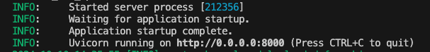
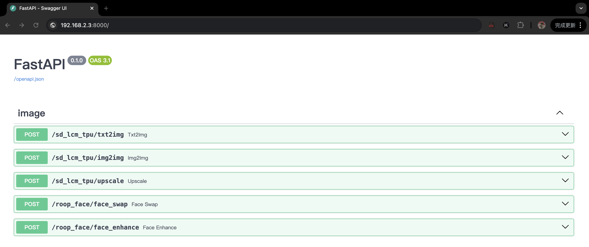
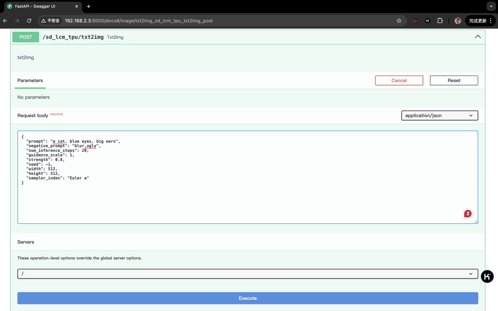

# AigcHub-TPU

本项目提供 Airbox（算能SG2300X inside）AIGC能力的一站式体验。
- 连接 Airbox 的方式：请参考 [Airbox Wiki](https://docs.radxa.com/sophon/airbox/getting-started/)。
- 当前可以在Airbox运行的应用如[列表](https://gitee.com/zilla0717/AirboxWiki/blob/master/README.md)所示，部分已经接入到本项目。欢迎参考[开发指南](docs/developer_tutorial.md)将这些应用以及其他实用有趣的应用接入进来。

## 支持应用列表

| 模块名称 | GitHub链接 |  功能描述 |
|--------------|-------------------| ------------------|
| roop_face | https://github.com/ZillaRU/roop_face.git | 人像换脸、人脸修复、人脸增强 |
| sd_lcm_tpu | https://github.com/ZillaRU/SD-lcm-tpu.git | 文生图、图生图、语义超分 |
| img2txt | https://github.com/ZillaRU/ImageSpeaking.git | 看图说话、生成图像描述 |
| upscaler_tpu | https://github.com/ZillaRU/upscaler_tpu.git | 图像超分 |
| emotivoice | https://github.com/ZillaRU/EmotiVoice-TPU.git | 文本转语音（支持情感控制）、音色克隆 |

此处的内容与`app.txt`中一致。app.txt中每行的第一列是该仓库作为模块的名称，第二列是对应的 github 仓库地址，第三列是该模块的功能类别。

**注意**：
- 这些应用仓库在本项目中作为模块使用，因此**名称可能与原始的仓库不同**（模块名仅能包含字母、数字和下划线，且不能以数字开头）。
- GitHub仓库必须是当前用户有访问权限的（建议直接设置为public）。


## 如何使用 AigcHub 中的已有应用
使用上一节列表中的应用，仅需要按照以下步骤。
### 1. 下载本项目并初始化环境 (初次使用 AigcHub)
```sh
git clone https://github.com/ZillaRU/AigcHub-TPU.git && bash scripts/init_env.sh
```

### 2. 应用初始化 (初次安装某个应用)
\* 如果本项目有更新的版本，建议先执行`git pull`更新本项目代码。

执行下面的命令：
```sh
bash scripts/init_app.sh app.txt中的模块名称
```
其中`app.txt中的模块名称`可以是多个，用空格分开。比如`bash scripts/init_app.sh emotivoice roop_face`。

这一步会从github获取模块的源码、配置环境、下载默认的模型文件。

### 3. 启动指定的后端服务
- 执行`bash scripts/run.sh 模块名称`
模块名称可以是多个，用空格分隔。例如，同时启动生图和换脸应用`bash scripts/run.sh image_gen roop_face`。



请注意，由于Airbox的 TPU 内存限制，部分应用不能同时启动，内存修改的方法请参考[docs](https://docs.radxa.com/sophon/airbox/local-ai-deploy/ai-tools/memory_allocate)。

- 出现上图中的输出后，浏览器访问`盒子ip:8000/docs`，此时可以看到后台开始启动各模块的应用。启动完毕后，显示如图：


- 查看并测试接口：选择对应接口并点击`Try it out`即可在当前选项卡编辑请求并发送，response 将会显示在下方。各 API 的 request定义可以在页面最下方看到。

