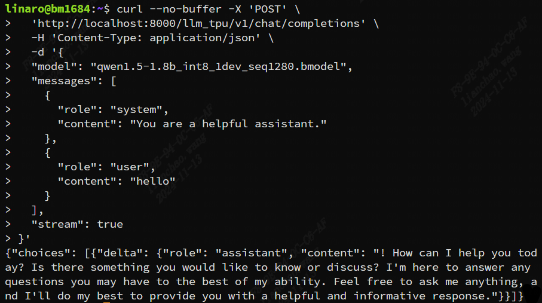
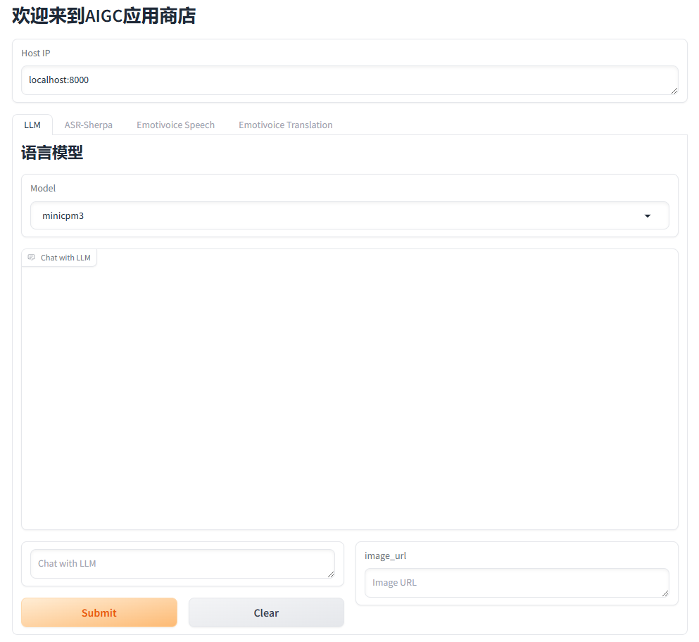

# AigcHub-TPU

本项目提供 Airbox（算能SG2300X inside）AIGC能力的一站式体验。

- 连接 Airbox 的方式：请参考 [Airbox Wiki](https://gitee.com/zilla0717/AirboxWiki)。
- 当前可以在Airbox运行的应用如[列表](https://gitee.com/zilla0717/AirboxWiki/blob/master/README.md)所示，部分已经接入到本项目。欢迎参考[开发指南](docs/developer_tutorial.md)将这些应用以及其他实用有趣的应用接入进来。

## 支持应用列表

| 模块名称     | 功能描述                             | 内存占用 |   兼容openai api | 视频教程 |
| ------------ | ----------------------------------- | -------- | -------- | -------- |
| [roop_face](https://github.com/ZillaRU/roop_face.git)      | 人像换脸<br>人脸增强         |          | `/v1/images/variations`<br>`/v1/images/edit` |              |
| [sd_lcm_tpu](https://github.com/wlc952/SD-lcm-tpu.git)     | 文生图<br>图生图<br>语义超分  |          | `/v1/images/generations`<br>`/v1/images/edits`<br>`/v1/images/variations` |              |
| [img2txt](https://github.com/ZillaRU/ImageSpeaking.git)  | 看图说话、生成图像描述           |          | `/v1/images/variations` |              |
| [upscaler_tpu](https://github.com/ZillaRU/upscaler_tpu.git)   | 图像超分                   |          | `/v1/images/variations` |              |
| [emotivoice](https://github.com/ZillaRU/EmotiVoice-TPU.git) | 文本转语音（支持情感控制）<br>音色克隆  |           | `/v1/audio/speech`<br>`/v1/audio/translation` |              |
| [gptsovits](https://github.com/wlc952/GPT-SoVITS-TPU.git)  | 音色克隆                       | 2203 MB  | `/v1/audio/speech` |              |
| [flowmirror](https://github.com/wlc952/flow_mirror_tpu.git) | 语音对话（目前效果不佳）        | 4375 MB  | `/v1/audio/translation` |              |
| [whisper](https://github.com/wlc952/whisper-TPU.git)     | 语音转文本                        | 844 MB   | `/v1/audio/transcriptions` |              |
| [rmbg](https://github.com/wlc952/rmbg_tpu.git)        | 图像去背景                           | 256 MB   | `/v1/images/edit` |              |
| [llm_tpu](https://github.com/wlc952/llm_aigchub.git)     | 大语言模型（Phi3, Qwen1.5,<br>Qwen2.5, MiniCPM-V2.6, MiniCPM3）| ~ 1.5-5 G | `/v1/chat/completions` |              |
| [sherpa](https://github.com/wlc952/Kaldi-TPU.git)       | 语音转文本                          |  ~ 255 MB  | `/v1/audio/transcriptions` |              |

此处的内容与 `app.txt`中一致。app.txt中每行的第一列是该仓库作为模块的名称，第二列是对应的 github 仓库地址，第三列是该模块的功能类别。

**注意**：

- 这些应用仓库在本项目中作为模块使用，因此**名称可能与原始的仓库不同**（模块名仅能包含字母、数字和下划线，且不能以数字开头）。
- GitHub仓库必须是当前用户有访问权限的（建议直接设置为public）。

## 如何使用 AigcHub 中的已有应用

用户使用上一节列表中的应用，仅需要按照以下步骤操作。

### 1. 下载本项目并初始化环境 (初次使用 AigcHub)

```sh
git clone https://github.com/ZillaRU/AigcHub-TPU.git && bash scripts/init_env.sh
```

### 2. 应用初始化（初次安装某个应用）

\* 如果本项目有更新的版本，建议先执行 `git pull`更新本项目代码。

执行下面的命令：

```sh
bash scripts/init_app.sh app.txt中的模块名称
```

其中 `app.txt中的模块名称`可以是多个，用空格分开。比如 `bash scripts/init_app.sh emotivoice roop_face`。

这一步会从github获取模块的源码、配置环境、下载默认的模型文件。

### 3. 启动指定的后端服务

- 执行 `bash scripts/run.sh 模块名称`
  模块名称可以是多个，用空格分隔。例如，同时启动生图和换脸应用 `bash scripts/run.sh image_gen roop_face`。
  
  
  
  请注意，由于Airbox的 TPU 内存限制，部分应用不能同时启动，内存修改的方法请参考[docs](https://docs.radxa.com/sophon/airbox/local-ai-deploy/ai-tools/memory_allocate)。

- 出现上图中的输出后，浏览器访问 `盒子ip:8000/docs`，此时可以看到后台开始启动各模块的应用。启动完毕后，显示如图：
  
  
- 查看并测试接口：选择对应接口并点击 `Try it out`即可在当前选项卡编辑请求并发送，response 将会显示在下方。各 API 的 request定义可以在页面最下方看到。
  
  

- 以whisper模块为例，其Request和返回值与openai的 `/v1/audio/transcriptions`兼容。POST的形式统一为 `f"http://{ip}:8000/{appname}/{openai_api}"`，如：`http://localhost:8000/whisper/v1/audio/transcriptions`

  ```bash
  ### 测试命令示例
  curl http://localhost:8000/whisper/v1/audio/transcriptions \
    -F 'file=@/data/AigcHub-TPU/repo/whisper/datasets/test/demo.wav;type=audio/wav' \
    -F 'model=base'
  ```

- 以llm_tpu模块为例
  
  

### 4 AigcHub web demo 前端服务

参考samples文件夹，调用api的应用，可在其他客户机上单独运行。


